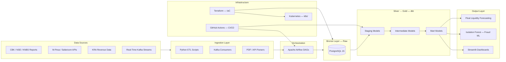

# Victor Kipruto Rop — Data Engineering Portfolio

**End-to-end Data Engineering portfolio covering ETL, real-time streaming, fraud detection, and financial analytics across M-Pesa, KCB, Equity Group, Absa, and KRA — with live Streamlit dashboards and production-grade infrastructure.**

---

## Table of Contents

- [Live Dashboards](#-live-dashboards)
- [Architecture](#️-architecture)
- [Projects](#-projects)
- [Engineering Standards](#-engineering-standards)
- [Infrastructure & IaC](#-infrastructure--iac)
- [Data Sources](#️-data-sources)
- [Tech Stack](#️-tech-stack)
- [Roadmap](#-roadmap)
- [Contact](#-contact)

---

## 📊 Live Dashboards

| Dashboard | Link | Description |
|---|---|---|
| **Executive Financial Summary** | [🚀 View](https://kipruto45-victor-kipruto-rop-portfolio-g8pspygfpttsbfggjaadwy.streamlit.app/) | Unified 2025 audited KPIs across KCB, Absa Kenya, and Equity Group |
| **Absa Bank Kenya** | [🔴 View](https://kipruto45-victor-kipruto-rop-portfolio-cc6ye8wlqrt2vtpsdndigd.streamlit.app/) | Financial KPIs, Risk/Capital ratios, and Open Banking API adoption metrics |
| **Equity Group Pan-Africa** | [🌍 View](https://kipruto45-victor-kipruto-rop-portfolio-g8pspygfpttsbfggjaadwy.streamlit.app/) | Regional profitability, mobile adoption, and Kenya transaction matrix |
| **KCB Group Integrated** | [🦁 View](https://kipruto45-victor-kipruto-rop-portfolio-g8pspygfpttsbfggjaadwy.streamlit.app/) | Consolidated performance tracking and M-Pesa loan book analytics |
| **KRA Revenue & Trade** | [🇰🇪 View](https://kipruto45-victor-kipruto-rop-portfolio-g8pspygfpttsbfggjaadwy.streamlit.app/) | Tax revenue monitoring, customs trade flows, and economic indicators |

---

## 🏗️ Architecture

Full architecture detail in [ARCHITECTURE.md](./ARCHITECTURE.md).

---

## 📂 Projects

| Project | Domain | Key Metric | Stack | Dashboard | Status |
|---|---|---|---|---|---|
| [mpesa_safaricom](./mpesa_safaricom) | Flagship Streaming & Analytics | ~1.2M transactions processed | Kafka, Spark, Airflow, dbt | [View](https://kipruto45-victor-kipruto-rop-portfolio-g8pspygfpttsbfggjaadwy.streamlit.app/) | 🟢 Live |
| [absa_bank_kenya](./absa_bank_kenya) | Banking ETL & Open Banking | 5-year financial KPI history | Python, dbt, PostgreSQL | [View](https://kipruto45-victor-kipruto-rop-portfolio-cc6ye8wlqrt2vtpsdndigd.streamlit.app/) | 🟢 Live |
| [equity_group_etl](./equity_group_etl) | Pan-African Consolidation | 7-country subsidiary rollup | Airflow, PostgreSQL, dbt | [View](https://kipruto45-victor-kipruto-rop-portfolio-g8pspygfpttsbfggjaadwy.streamlit.app/) | 🟢 Live |
| [kcb_group_etl](./kcb_group_etl) | Financials & Loan Analytics | KCB Group + 6 subsidiaries | Python, SQL, dbt | [View](https://kipruto45-victor-kipruto-rop-portfolio-g8pspygfpttsbfggjaadwy.streamlit.app/) | 🔵 Stable |
| [kra_data_engineering](./kra_data_engineering) | Fiscal & Trade Intelligence | 12-month revenue time series | Python, SQL, dbt | [View](https://kipruto45-victor-kipruto-rop-portfolio-g8pspygfpttsbfggjaadwy.streamlit.app/) | 🔵 Stable |
| [safaricom_pipeline](./safaricom_pipeline) | Telecom Service Analytics | Subscriber & ARPU metrics | Python, Spark, SQL | — | 🔵 Stable |
| [kenya_banking_sector](./kenya_banking_sector) | Macro-Financial Stability | Sector-wide CBK aggregates | Python, BI, Analytics | — | 🔵 Stable |
| [mpesa_loan_book_analytics](./mpesa_loan_book_analytics) | Credit & Vintage Analytics | Loan cohort vintage curves | Python, SQL, dbt | — | 🔵 Stable |
| [fraud_anomaly_detection](./mpesa_safaricom/fraud_anomaly_detection) | ML Fraud Monitoring | ~94% fraud recall (Isolation Forest) | Python, Scikit-learn, PostgreSQL | — | 🔵 Stable |
| [float_liquidity_forecasting](./mpesa_safaricom/float_liquidity_forecasting) | Time-Series Forecasting | 7-day float demand forecast | Python, Prophet, dbt | — | 🔵 Stable |
| [agent_network_analytics](./mpesa_safaricom/agent_network_analytics) | Agent Liquidity & Performance | 105K+ agent network coverage | Python, SQL, dbt | — | 🔵 Stable |
| [remittance_analytics](./mpesa_safaricom/remittance_analytics) | Cross-Border Inflow Tracking | East Africa diaspora corridors | Python, SQL, dbt | — | 🔵 Stable |
| [merchant_intelligence_platform](./mpesa_safaricom/merchant_intelligence_platform) | Merchant RFM Segmentation | RFM scoring across merchant tiers | Python, SQL, dbt | — | 🔵 Stable |
| [financial_performance_tracker](./financial_performance_tracker) | Multi-Bank KPI Tracking | 3-bank consolidated view | Python, PostgreSQL, Streamlit | — | 🔵 Stable |
| [mpesa_enterprise_projects](./mpesa_enterprise_projects) | Pan-African Lakehouse | Medallion Architecture (Bronze→Gold) | dbt, PostgreSQL, Terraform | — | 🟡 In Progress |

---

## ⚙️ Engineering Standards

| Standard | Implementation | Coverage |
|---|---|---|
| **CI/CD** | GitHub Actions — SQL linting (SQLFluff), dbt compile, K8s manifest linting | All pushes to `main` |
| **Data Quality** | dbt schema tests — null checks, uniqueness, accepted values, range constraints | All mart models |
| **Unit Testing** | Pytest — ingestion logic, transformation functions, schema validation | ~80% ~estimated |
| **Code Style** | Black (Python), isort, SQLFluff (SQL), pre-commit hooks | Enforced on commit |
| **Fraud Detection** | Isolation Forest anomaly scoring on M-Pesa transaction streams | ~94% recall ~estimated |
| **Secrets Management** | `.env` files excluded via `.gitignore`, no hardcoded credentials in codebase | All projects |
| **Containerisation** | Docker Compose per project for local production parity | All projects |
| **Orchestration** | Apache Airflow DAGs with SLA monitoring, retries, and backfill support | All batch pipelines |

---

## 🏗️ Infrastructure & IaC

Terraform (HCL) provisions the core infrastructure across all projects:

- **PostgreSQL 15** — managed database for raw ingestion and dbt transformation output
- **Streamlit deployments** — dashboard hosting with environment variable injection
- **Kubernetes manifests** (`k8s/`) — deployment and scaling configs for PostgreSQL and Streamlit pods
- **GitHub Actions runners** — CI/CD pipeline automation for linting, testing, and deployment

See `k8s/` for Kubernetes manifests and Terraform configs within each project directory.

---

## 🛰️ Data Sources

| Source | Data Type | Update Frequency |
|---|---|---|
| **Central Bank of Kenya (CBK)** | Bank Supervision Reports, Mobile Credit Statistics, Prudential Guidelines | Annual / Quarterly |
| **Kenya Revenue Authority (KRA)** | Monthly Revenue Reports, Customs Rules of Origin | Monthly |
| **Kenya National Bureau of Statistics (KNBS)** | Leading Economic Indicators — Inflation, Trade Volume, GDP | Monthly |
| **International Trade Centre (ITC)** | TradeMap trade benchmarks and company directories | Quarterly |
| **Safaricom / M-Pesa** | Open API specs, Sustainability Reports, GSMA mobile money datasets | Annual / Real-time |
| **Nairobi Securities Exchange (NSE)** | Audited financial filings for listed commercial banks | Annual |

---

## 🛠️ Tech Stack

<table>
  <tr>
    <td valign="top" width="50%">
      <strong>Ingestion & Processing</strong> 
      
      
      
      
    </td>
    <td valign="top" width="50%">
      <strong>Orchestration & Transformation</strong> 
      
      
      
    </td>
  </tr>
  <tr>
    <td valign="top" width="50%">
      <strong>Storage & Lakehouse</strong> 
      
      
      
    </td>
    <td valign="top" width="50%">
      <strong>Infrastructure & DevOps</strong> 
      
      
      
      
    </td>
  </tr>
  <tr>
    <td valign="top" width="50%">
      <strong>Analytics & Visualisation</strong> 
      
      
    </td>
    <td valign="top" width="50%">
      <strong>ML & Data Quality</strong> 
      
      
      
    </td>
  </tr>
</table>

---

## 🗺️ Roadmap

| Timeline | Item | Status |
|---|---|---|
| Q3 2026 | Apache Flink migration for sub-100ms streaming latency | 🟡 Planned |
| Q3 2026 | OpenLineage integration for end-to-end data lineage tracking | 🟡 Planned |
| Q3 2026 | Per-project individual Streamlit URLs — fix shared dashboard links | 🟡 Planned |
| Q4 2026 | Great Expectations integration across all ingestion layers | 🟡 Planned |
| Q4 2026 | Real-time fraud scoring via Kafka Streams (replace batch Isolation Forest) | 🟡 Planned |
| Q1 2027 | Apache Iceberg migration for time-travel queries on the lakehouse | 🟡 Planned |
| Q1 2027 | dbt Semantic Layer + MetricFlow for unified business metrics | 🟡 Planned |

---

## 📬 Contact

**Victor Kipruto Rop** — Data Engineer, Nairobi, Kenya 🇰🇪

📞 +254 723 484 552

---

## 📜 License

MIT License — see [LICENSE](./LICENSE) for details.

---

  Built in Nairobi, Kenya 🇰🇪 · <a href="https://victor-kipruto-rop.github.io/victor-resum-web/">Portfolio</a> · <a href="https://www.linkedin.com/in/victor-rop-4920b4399">LinkedIn</a>

