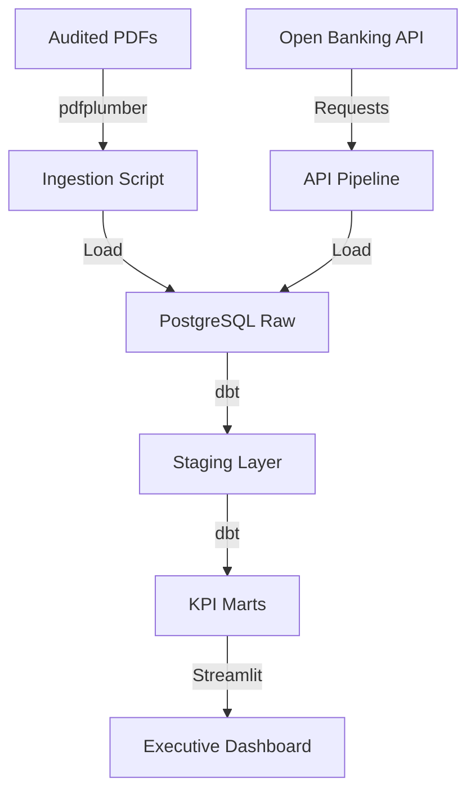

# 🔴 Absa Bank Kenya Integrated Platform

## Overview
This platform consolidates Absa Bank Kenya's financial performance tracking and Open Banking API integration. It provides a unified data layer for analyzing audited fiscal results alongside real-time transaction activity.

## Architecture


## Data Sources
- **Audited Financials**: FY 2021-2025 Integrated Reports and Pillar 3 Disclosures.
- **Open Banking**: Real-time transaction feeds from the Absa Developer Playpen.

## Tech Stack
- **Ingestion**: Python (pdfplumber, requests)
- **Transformation**: dbt Core
- **Database**: PostgreSQL 15
- **Orchestration**: Apache Airflow
- **Visualization**: Streamlit, Plotly

## Folder Structure
```text
absa_bank_kenya/
├── dashboards/         # SQL dashboard definitions
├── dbt/                # Consolidated dbt project
├── financial_kpi_warehouse/  # KPI-specific logic
├── open_banking_api_pipeline/ # API-specific logic
├── tests/              # dbt and python tests
├── docker-compose.yml  # Local stack definition
└── README.md
```

## How to Run
1. **Setup Env**:
   ```bash
   cp .env.example .env
   # Add ABSA_CONSUMER_KEY and ABSA_CONSUMER_SECRET
   ```
2. **Launch Stack**:
   ```bash
   docker-compose up -d
   ```
3. **Run dbt**:
   ```bash
   cd dbt
   dbt run
   ```
4. **Access Dashboard**: Open `http://localhost:8501`

## Key Metrics / Outputs
- **Net Profit & ROE**: Annualized profitability trends.
- **Capital Adequacy**: CAR tracking against statutory minimums.
- **Digital Adoption**: API transaction volume and velocity.
