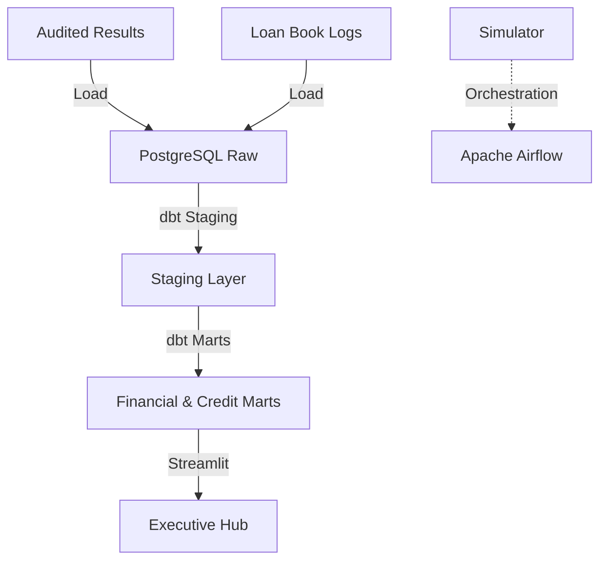

# 🦁 KCB Group Integrated ETL & Analytics Platform

## Overview
This platform manages the ETL and analytical pipelines for KCB Group. it consolidates financial performance data across all regional subsidiaries and provides a detailed vintage analysis of the M-Pesa mobile loan book.

## Architecture


## Data Sources
- **Audited Financials**: FY 2021-2025 Consolidated and Subsidiary reports.
- **M-Pesa Loan Data**: High-fidelity logs of mobile loan disbursements and repayments.

## Tech Stack
- **Orchestration**: Apache Airflow
- **Transformation**: dbt Core (PostgreSQL)
- **Database**: PostgreSQL 15
- **Visualization**: Streamlit, Plotly
- **Environment**: Docker, Docker Compose

## Folder Structure
```text
kcb_group_etl/
├── dags/               # Financial & Credit ETL DAGs
├── dbt/                # Consolidated dbt project
├── ingestion/          # PDF extraction and loan loading
├── dashboards/         # Visualization layer
├── tests/              # dbt and python tests
├── docker-compose.yml  # Local stack definition
└── README.md
```

## How to Run
1. **Launch Stack**:
   ```bash
   docker-compose up -d
   ```
2. **Execute dbt**:
   ```bash
   cd dbt
   dbt run
   dbt test
   ```
3. **Access Dashboard**: Open `http://localhost:8503`

## Key Metrics / Outputs
- **ROE & ROA**: Regional efficiency benchmarking.
- **Vintage Curves**: Default rate evolution by disbursement cohort.
- **NIM Trends**: Net Interest Margin tracking across markets.
