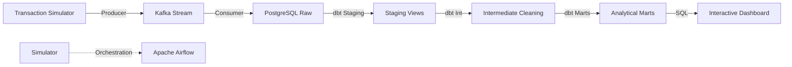

# 🟢 M-Pesa Safaricom Integrated Flagship Pipeline

## Overview
This is a production-grade data engineering project that simulates and analyzes real-time M-Pesa transactions. It demonstrates a high-fidelity streaming architecture, automated data transformations with dbt, and a real-time visualization layer.

## Architecture


## Data Sources
- **Real-Time Stream**: Simulated M-Pesa transaction events (amount, type, county, fraud label).
- **Master Data**: Regional county mappings and transaction categories.

## Tech Stack
- **Streaming**: Kafka, Python
- **Orchestration**: Apache Airflow
- **Transformation**: dbt (PostgreSQL)
- **Database**: PostgreSQL 15
- **Visualization**: Streamlit, Plotly
- **Testing**: Pytest, dbt tests
- **Environment**: Docker, Docker Compose

## Folder Structure
```text
mpesa_safaricom/
├── config/             # Configuration templates
├── dags/               # Airflow DAG definitions
├── dashboards/         # Streamlit application
├── dbt/                # dbt models and tests
├── ingestion/          # Kafka producer/consumer
├── streaming/          # Real-time processing logic
├── tests/              # Pytest suite
├── docker-compose.yml  # Full stack definition
└── requirements.txt    # Pinned dependencies
```

## How to Run
1. **Prerequisites**: Install Docker and Docker Compose.
2. **Setup Environment**:
   ```bash
   cp .env.example .env
   # Update .env with your credentials
   ```
3. **Launch Stack**:
   ```bash
   docker-compose up -d
   ```
4. **Install Locally** (Optional):
   ```bash
   pip install -r requirements.txt
   ```
5. **Run Simulator**:
   ```bash
   python ingestion/kafka_producer.py
   python ingestion/kafka_consumer.py
   ```
6. **Execute Transformations**:
   ```bash
   cd dbt
   dbt run
   dbt test
   ```
7. **Access Dashboard**: Open `http://localhost:8510`

## Key Metrics / Outputs
- **Total Volume**: Aggregated real-time transaction volume.
- **Fraud Concentration**: Geographic and temporal heatmap of flagged transactions.
- **County Leaderboard**: Top-performing regions by transaction velocity.

## Dashboard Preview

