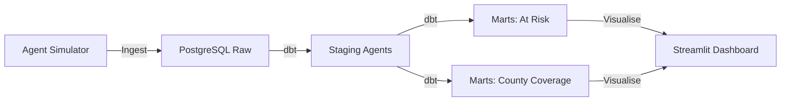

# 🏪 M-Pesa Agent Network Liquidity Analytics

## Overview
This project monitors the liquidity (float) and performance of M-Pesa agents across Kenya. It provides real-time visibility into "at-risk" agents with low float and identifies geographic gaps in float coverage.

## Architecture


## Data Sources
- **Simulated Agent Data**: 200+ agent records with float balances, location, and transaction activity.

## Tech Stack
- **Python**: Ingestion and simulation.
- **dbt**: Transformation and risk logic.
- **PostgreSQL**: Warehouse.
- **Streamlit**: Visualization.

## Folder Structure
```text
agent_network_analytics/
├── ingestion/          # Agent data generator
├── dbt/                # Transformation layer
├── dashboards/         # Streamlit application
├── data/               # CSV snapshots
└── README.md
```

## Key Metrics / Outputs
- **Float Liquidity**: Total float volume across the network.
- **Critical Alerts**: Real-time list of agents falling below the minimum float threshold (5,000 KES).
- **County Coverage**: Float density per county to optimize re-stocking routes.
