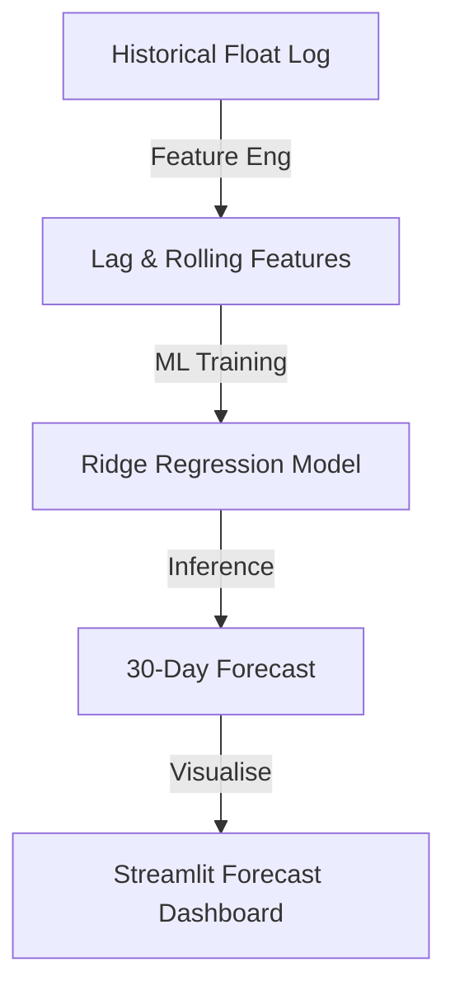

# 📈 M-Pesa Agent Float Liquidity Forecasting

## Overview
This project provides a predictive analytics pipeline for managing M-Pesa agent float demand. It uses historical demand data to train a time-series forecasting model, helping Safaricom and super-agents optimize liquidity distribution.

## Architecture

## Data Sources
- **Historical Float Demand**: 12 months of daily aggregated demand data per region.
- **Calendar Data**: Inclusion of weekends and payday cycles (month-end) as predictive features.

## Tech Stack
- **Python**: Scikit-Learn, Pandas.
- **dbt**: Planned integration for feature store.
- **Streamlit**: Visualization of prediction intervals.

## Key Metrics / Outputs
- **Expected Demand**: Projected KES requirements for the next 30 days.
- **Peak Identification**: Flags upcoming high-demand periods (e.g., paydays).
- **Error Metrics**: RMSE/MAPE tracking for model reliability.
