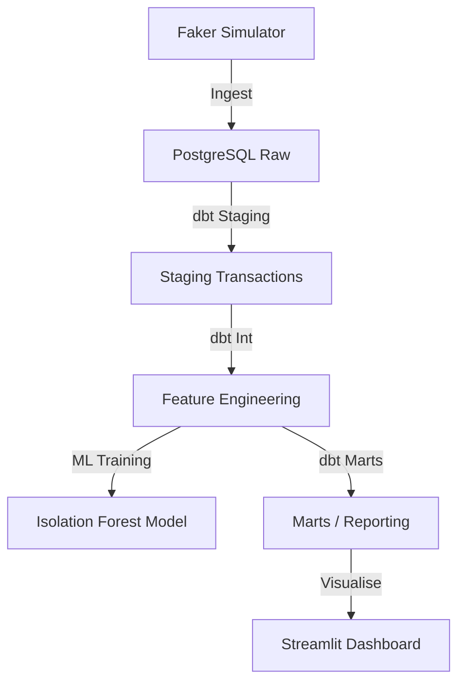

# 🛡️ M-Pesa Fraud Anomaly Detection Pipeline

## Overview
This project builds a complete end-to-end fraud detection system for mobile money transactions. It combines data engineering (PostgreSQL + dbt) with machine learning (Isolation Forest) to identify suspicious patterns in real-time.

## Architecture


## Data Sources
- **Simulated Transactions**: 2,000+ M-Pesa records with varying amounts, counties, and fraud patterns (high volume, unusual hours).

## Tech Stack
- **Languages**: Python (Pandas, Scikit-Learn)
- **Transformation**: dbt
- **Database**: PostgreSQL 15
- **Visualization**: Streamlit

## Folder Structure
```text
fraud_anomaly_detection/
├── ingestion/          # Transaction simulator
├── dbt/                # Transformation layer
├── models/             # ML training scripts
├── tests/              # Pytest for logic
├── dashboards/         # Visualization
└── README.md
```

## How to Run
1. **Setup Env**:
   ```bash
   cp .env.example .env
   ```
2. **Ingest Data**:
   ```bash
   python ingestion/simulator.py
   ```
3. **Run dbt**:
   ```bash
   cd dbt
   dbt run
   ```
4. **Train ML**:
   ```bash
   python models/train_fraud_model.py
   ```
5. **Dashboard**:
   ```bash
   streamlit run dashboards/fraud_dashboard.py
   ```

## Key Metrics / Outputs
- **Fraud Rate by County**: Identifies high-risk geographic zones.
- **Time-of-Day Risk**: Temporal analysis of fraudulent activity.
- **Anomalous Z-Scores**: Flags transactions significantly deviating from user history.
