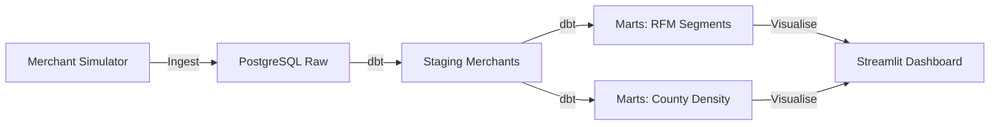

# 🏢 M-Pesa Merchant Intelligence Platform

## Overview
This project provides operational insights into the M-Pesa merchant ecosystem. It automates the classification of merchants into segments (Enterprise, SME) and models churn risk to help the sales team prioritize retention efforts.

## Architecture


## Data Sources
- **Simulated Merchant CRM**: 300+ merchant profiles with transaction volumes, categories, and churn risk scores.

## Tech Stack
- **Python**: Ingestion and simulation.
- **dbt**: RFM segmentation logic.
- **PostgreSQL**: Warehouse.
- **Streamlit**: Visualization.

## Folder Structure
```text
merchant_intelligence_platform/
├── ingestion/          # Merchant data generator
├── dbt/                # Transformation layer
├── dashboards/         # Streamlit application
├── data/               # CSV snapshots
└── README.md
```

## Key Metrics / Outputs
- **Segmentation**: Automated SME vs. Enterprise classification.
- **Churn Risk**: Leaderboard of merchants likely to stop using M-Pesa.
- **Market Density**: Geographic distribution of merchant categories (e.g., Pharmacy, Retail).
