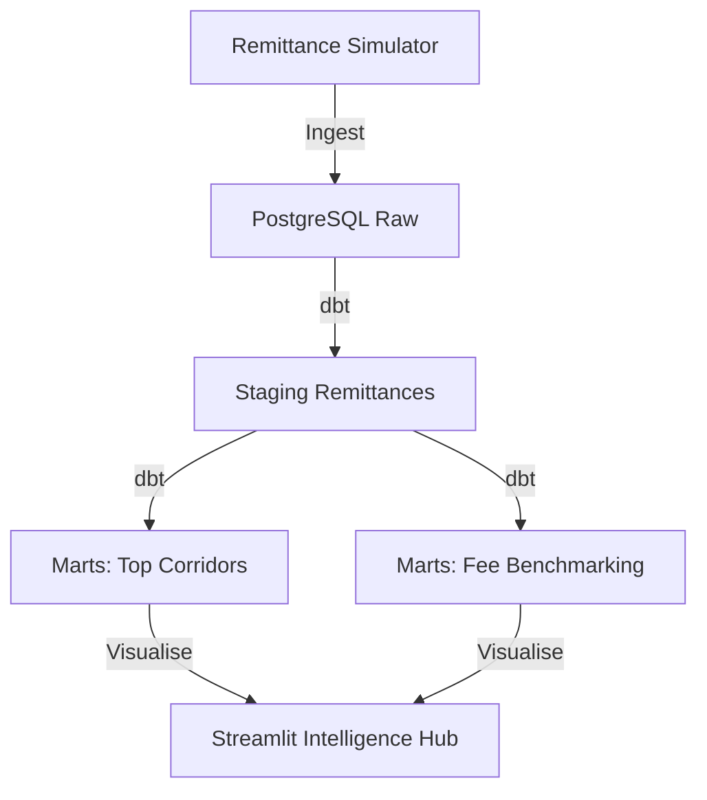

# 🌍 Kenya Cross-Border Remittance Analytics

## Overview
This project analyzes the flow of international remittances into Kenya. It provides insights into the most active sending corridors, fee structures, and monthly inflow trends, supporting strategic decision-making for M-Pesa International.

## Architecture


## Data Sources
- **World Bank Aligned Data**: Simulated remittance records (1,500+) with corridor, amount, and fee data.

## Tech Stack
- **Python**: Ingestion and simulation.
- **dbt**: Transformation layer.
- **PostgreSQL**: Warehouse.
- **Streamlit**: Visualization.

## Folder Structure
```text
remittance_analytics/
├── ingestion/          # Remittance data generator
├── dbt/                # Transformation layer
├── dashboards/         # Streamlit application
├── data/               # CSV snapshots
└── README.md
```

## Key Metrics / Outputs
- **Total Inflow (USD)**: Monthly and cumulative remittance volumes.
- **Corridor Analysis**: Ranking of countries by contribution to Kenyan inflows.
- **Fee Efficiency**: Distribution of transfer costs across different corridors.
